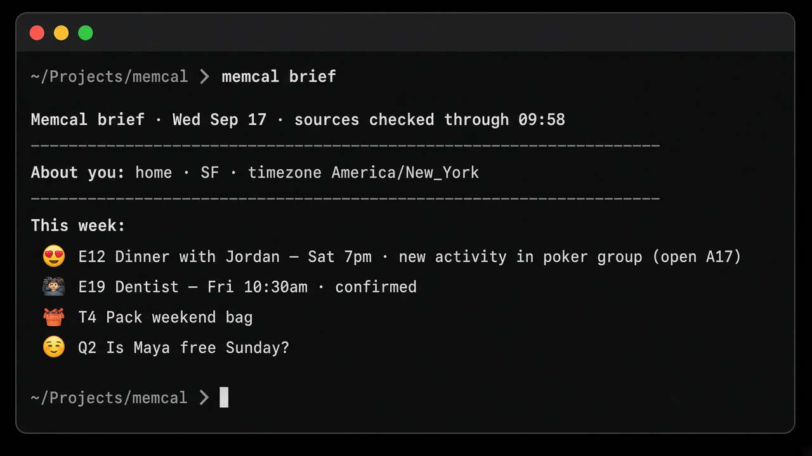

# memcal

**Memory + Calendar for AI agents**

[](https://pypi.org/project/memcal/)
[](https://www.python.org/downloads/)
[](LICENSE)
[](https://cuuush.github.io/memcal/)

Most memory systems for agents like OpenClaw or Hermes (Mem0, Hindsight) are good at saving things like preferences and observations, but fail at personal assistant tasks, like remembering you have a dentist appointment next Friday. Memcal attempts to bridge this gap by enabling an agent to maintain its own internal calendar of your life. On top of that, a nightly fact-gathering stage will scan sources like iMessage, email, WhatsApp, iCal, and more to automatically update the agent calendar.

With Memcal, you can ask an agent, “What’s my weekend looking like?” and it will remember that your friend is free for dinner Saturday night, that the nonprofit you follow is having a member day, or even that your family is coming into town...



## Under the hood

- **Write-time recency** — updates move old values to history; read time isn’t a relevance fight ([memcal vs retrieval](https://cuuush.github.io/memcal/architecture/memcal-vs-rag/))
- **Brief in the prompt** — the week is already in context for implicit questions
- **Typed stores** — events, series, todos, questions, wiki
- **Multi-stream join** — Slack, Messages, email, calendar, and agent chat resolve to one underlying thing
- **Nightly dream pass** — observe → gate → propose → merge → brief

## Install

Requires Python 3.11+, SQLite with FTS5, and one model backend (Codex by default; Claude Code, Antigravity, or OpenRouter also work).

### Quick start

```bash
pip install memcal
memcal setup
memcal doctor
memcal brief
```

Memcal is built first for **macOS** — Messages, Calendar (EventKit), and launchd scheduling are the full product path. Connect those, then ask the agent what your week looks like.

Slack (`pip install 'memcal[slack]'`) and MCP work on any machine if you want chat without the Apple sources.

From source (alternate):

```bash
git clone https://github.com/cuuush/memcal.git
cd memcal
./install.sh
```

Memcal reads sensitive personal data and sends selected source text to the model provider you configure — read the [privacy notes](https://cuuush.github.io/memcal/privacy/) before connecting real accounts.

## MCP (any harness)

```bash
python3 -m memcal.mcp_server
```

Native plugins: [Hermes](https://cuuush.github.io/memcal/integrations/hermes/) · [OpenClaw](https://cuuush.github.io/memcal/integrations/openclaw/)

## Learn more

Full guides: **https://cuuush.github.io/memcal/**

- [Quickstart](https://cuuush.github.io/memcal/quickstart/) — install, first ingest, nightly job
- [Sources](https://cuuush.github.io/memcal/sources/) — Slack, Telegram, WhatsApp, iMessage, Signal, email, calendar, …
- [CLI](https://cuuush.github.io/memcal/clients/cli/) · [MCP](https://cuuush.github.io/memcal/clients/mcp/) · [Integrations](https://cuuush.github.io/memcal/integrations/)
- [Evaluation](https://cuuush.github.io/memcal/evaluation/) — how memory quality is measured

Contributing: [CONTRIBUTING.md](CONTRIBUTING.md). Notable changes: [CHANGELOG.md](CHANGELOG.md).

